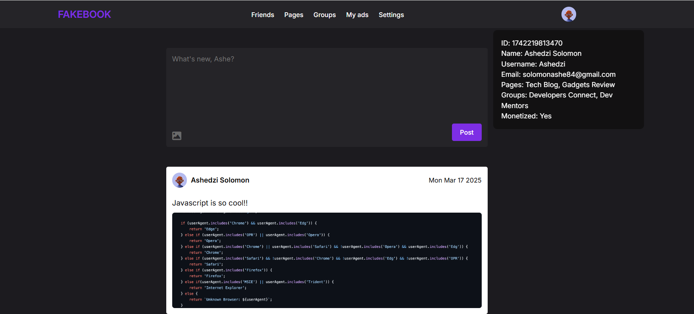

## Fakebook - A clone of the popular social media platform (Facebook)

#### Overview

A simple social media platform inspired by Facebook, built using Object-Oriented JavaScript (OOP) and DOM manipulation. Users can create posts, interact with content, and experience basic social networking features in a minimalistic web environment.

#### Project features 
Fake Book is designed to be **fully responsive**, providing a seamless experience across all devices. It features a **dynamic post creation system** where users can write and publish posts in real-time. The platform incorporates **interactive UI elements**, including like buttons that update dynamically and smooth post deletions for a clean feed experience. Built using **Object-Oriented JavaScript (OOP)**, the project demonstrates encapsulation and modular code structure to manage user interactions efficiently. The UI is **intuitive and visually engaging**, with **smooth scrolling**, **interactive hover effects**, and **real-time DOM updates**. Fake Book is structured to mimic core social media functionalities while maintaining simplicity and performance.

#### Technologies used 
- **HTML** – Structuring the content.
- **CSS** – Styling the interface with modern design elements, including animations and responsiveness for mobile and desktop devices.
- **JavaScript** – Adding interactivity and dynamic behavior, including post creation, like button functionality, and real-time DOM updates using Object-Oriented JavaScript principles.